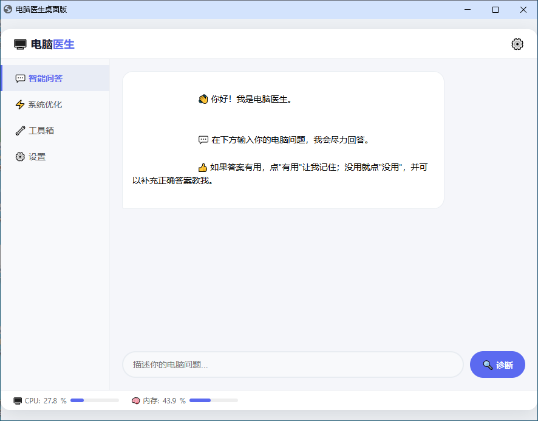

# 🖥️ 电脑医生 (PC Doctor)

> 一款**完全免费、无广告、可自学习**的 Windows 电脑优化工具。  
> 即使你完全不懂电脑，也能一键体检、诊断故障、管理系统。



---

## ✨ 功能亮点

### 🤖 智能诊断
- **AI 智能问答**：用大白话问电脑问题（如"电脑卡顿怎么办"），本地知识库自动匹配解决方案。
- **自学习知识库**：用户可以教它新知识，越用越聪明。

### ⚡ 系统优化
- **全面体检**：一键诊断电脑健康状态，给出评分和详细问题清单，支持一键修复。
- **硬件温度监控**：状态栏实时显示 CPU 和 GPU 温度，高温自动变色提醒。
- **系统还原点**：一键创建 Windows 系统还原点，优化前自动备份，安全无忧。
- **内存优化**：一键清理进程工作内存，让系统更流畅。

### 🔧 实用工具箱（3D 旋转木马交互）
- **重复文件查找**：扫描磁盘找出内容相同的文件，释放被白白占用的空间。
- **软件卸载助手**：列出已安装软件，支持强力卸载 + 残留扫描清理。
- **大文件扫描**：快速找出磁盘中的大文件，支持按盘符选择。
- **文件夹空间分析**：树形展示各文件夹占用空间，层层下钻定位空间大户。
- **隐私清理**：清理浏览器缓存、系统历史记录、微信/QQ缓存，保护隐私释放空间。
- **网络修复**：一键诊断 + 一键修复 + 网络测速。
- **右键菜单管理**：列出并禁用/启用右键菜单项，清理被软件塞满的菜单。
- **自启动管理**：管理开机启动程序，标注影响程度，支持禁用/启用。
- **网站屏蔽器**：一键屏蔽不想看的网站（基于 Hosts 文件）。
- **开机耗时分析**：分析启动项对开机速度的影响。
- **系统信息概览**：一键查看 CPU、内存、显卡、主板型号及磁盘使用情况。
- **文件粉碎机**：彻底删除文件，多次覆写不可恢复。
- **启动盘制作**：将 ISO 镜像写入 U 盘，制作系统启动盘。
- **深色模式**：一键切换深色/浅色主题，保护视力。

### 💻 实用工具
- **网速悬浮窗**：实时显示上传/下载速度，可拖拽、半透明、置顶。
- **管理员权限检测**：启动时自动检测，状态栏实时显示，非管理员时弹出提醒。
- **全新启动画面**：透明背景、Logo 高亮扫描、微粒子动画，启动更炫酷。

### 🔒 安全与免费
- **安全透明**：纯本地运行，不联网，不上传任何数据。代码完全开源。
- **永久免费**：无广告、无付费、无全家桶。

---

## 📥 下载与安装

### 方式一：下载安装包（推荐）

👉 **[点击下载最新版安装包](https://github.com/mhh190601/PC-Doctor/releases/download/v1.5.1/电脑医生安装包_v1.5.1.exe)**

下载后双击运行，按向导安装即可。  
支持 Windows 7 及以上系统。

### 方式二：从源码运行

```bash
# 克隆仓库
git clone https://github.com/mhh190601/PC-Doctor.git

# 进入项目目录
cd PC-Doctor

# 安装依赖
pip install -r requirements.txt

# 运行程序
python main.py
要求 Python 3.7 及以上版本，建议以管理员身份运行。

🛠️ 技术栈
模块	技术
桌面 GUI	Python + Eel
前端界面	HTML / CSS / JavaScript
AI 智能体	scikit-learn + jieba（TF-IDF 相似度匹配）
系统操作	psutil + winreg + ctypes + WMI
知识库	SQLite + 自学习权重调整
打包	PyInstaller + Inno Setup
🤝 贡献与反馈
欢迎任何形式的贡献！如果你有好的电脑问题解决方案，可以：

📝 提交 Pull Request 扩充知识库（knowledge_base.json）

🐛 在 Issues 中提交 Bug 或功能建议

⭐ 点个 Star 支持我继续开发

📄 许可证
本项目基于 MIT 许可证开源，详情请见 LICENSE 文件。

Made with ❤️ by mhh190601
